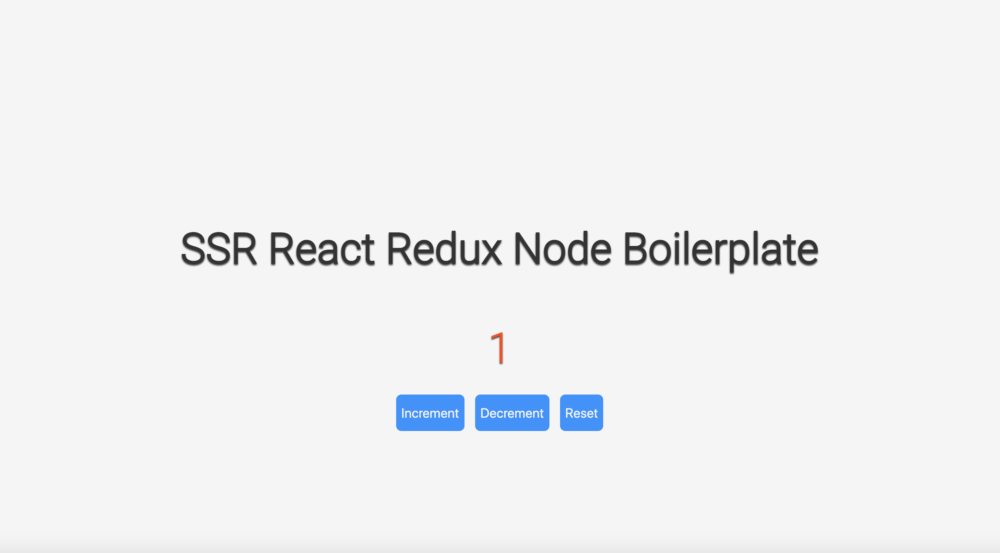

### SDLC Navigation

0. [Home](../../README.md)
1. [Planning And Requirement Analysis](../1_PlanningAndAnalysis/README.md)
2. [Defining Requirements](../2_DefiningRequirements/README.md)
3. [Design and Architecture](../3_DesignAndArchitecture/README.md)
4. Building
5. Testing
6. Deployment
7. Example Output
8. [Usage](../../FLAGS.md)

---

# 7. Example Output

All output will contain a file structure relivant to common practices according to the server language and front-end framework combination.

All builtin templates (those packaged with the program) will come with a README.md like the one below containing instructions on how to:
1. Start the server
2. What the localhost address is
3. Links to documentation on the Frameworks used
4. A detailed Layout explaining all the components of the template
**NOTE** It will not include a picture of the application in the browser like the one below.

Go to [this link](./Isomorphic-React-Redux/README.md) for a template that will be packaged with app-create.

Below is an example readme for a SSR (server-side rendering) Node and React with Redux template that will be shipped with the product.

---

#### Delete me and everything below me if you know [how to Write a good README](https://github.com/matiassingers/awesome-readme)

#### [This](https://github.com/othneildrew/Best-README-Template/blob/master/README.md) is another optional template to follow. *How to view the markdown*: On GitHub, click on README.md file then select *raw* from the right to view the actual markdown.

# Isomorphic React Redux Node Web Application

### How to use

1. clone the repo
2. ``` npm install ```
3. install ```nodemon``` if you haven't already by running ``` npm install -g nodemon ```
4. ``` npm run dev ```
5. navigate to [localhost:3000](http://localhost:3000)

### What it looks like



### Layout

```
|- public/ <--- output of the webpack.client.js configuration. Note the lack of an index.html file since it is SSR.
|   |- client.bundle.js
|   |- vender.bundle.js
|   |- runtime.bundle.js
|   |- client.css
|
|- build/ <--- output of the webpack.server.js configuration.
|   |- server.bundle.js <--- file that is run in package.json script dev:start to start the server.
|   |- server.css <-- not sent to browser. Must exists if we want to have a client.css separated from the client.bundle.js
|
|- src/ <--- all project code
|   |- client/
|   |   |- actionCreators/ <-- all functions the dispatcher grabs and passes to the reducers.
|   |   |   |- index.js <-- each function must be imported like so 'import { actionCreator }'
|   |   |
|   |   |- actions/ <--- put all actions here. Separated from actionCreators so IDE intellisence can pick up names.
|   |   |   |- index.js <-- just a place JavaScript object with values as strings
|   |   |
|   |   |- assets/ <--- if you have images, or any lib.min.js files, put them here
|   |   |   |-style/ <-- all css, less, or sass. This project uses sass.
|   |   |   |   |-main.scss <--- imported into App.jsx to load styles. All styling is exported as client.css in public/
|   |   |
|   |   |- components/ <--- all functional components that do not connect directly to redux go here
|   |   |   |- App.jsx <--- base React component
|   |   |
|   |   |- containers/ <--- all functional components that connect to redux state and actionCreators go here
|   |   |   |- Button.jsx <--- an example container component. All containers set up connections to redux state and state modifiers
|   |   |
|   |   |- reducers/ <--- Takes objects (actions) returned by action creators and determines which state needs to updated
|   |   |   |- countReducer.js
|   |   |   |- index.js <-- returns the compilation of all reducers. Map each reducer to one state variable here. Used in store.
|   |   |
|   |   |- store/ <-- returns a function to allow for integration with Redux dev tools in the browser. See usage in index.jsx
|   |   |   |- index.js
|   |   |
|   |   |- index.jsx <--- client bundle entry point. When corresponding bundle is sent, hydrates html sent from server.
|   |
|   |- server/ <--- contains all server logic
|   |   |- index.js <--- main server file. Server bundle entry point. Sends the html from renderIso to the client's browser.
|   |   |- renderIso.js <--- function called on all routes in server/index.js to build the html sent to the browser
|   |   |- renderHTML.js <--- helper function used by renderIso to build the html the server will send upon request
|
|- webpack.common.js <--- universal webpack setup. integrated into client and server config. Does not build any bundles.
|- webpack.client.js <-- configuration of client-side bundle; i.e. all files sent to the browser. See public/
|- webpack.server.js <--- configuration of server bundle. Outputs the file in build/ which is run by dev:start to start the server
|- .babelrc <-- could be place in package.json or wepack.common.js, but is preferable to separate babel config from webpack.
```